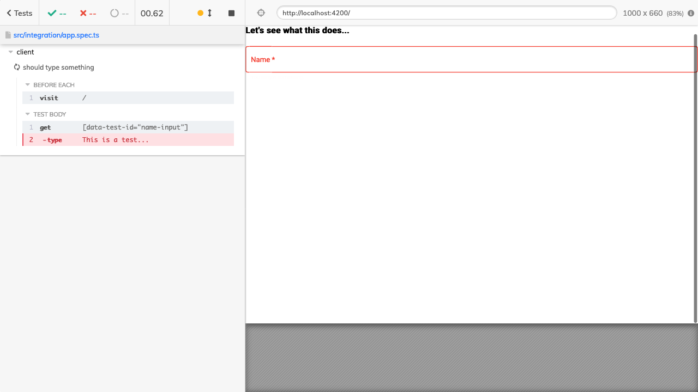

# Cypress Firefox 102 flakiness

> This repo is a reproduction of the following cypress issue [here.](https://github.com/cypress-io/cypress/issues/22760#issuecomment-1192326921)

## Reasons

In this repo I'm using Nx and Angular to be as close to what we have in our project as possible. Though there are sure some differences, but at the end of the day it has the same cypress + firefox 102 issue what we have. One thing that I have noticed so far that this is happening only where we are using Angular Formly with Material.

## Requirements & steps

- You should have Firefox 102 to be installed (if it's version 101 then it doesn't fail)
- Clone this repo: `git clone https://github.com/ducktordanny/cypress-firefox-flakiness.git`
- Install dependencies: `yarn`
- Try to run cypress tests in headless mode in Chrome: `npx nx e2e client-e2e --browser chrome` (it should run without any issues)
- Try the same with firefox: `npx nx e2e client-e2e --browser firefox` (it should throw an error `'cy.type()' failed because it targeted a disabled element.`)

## Screenshot & full error message



```shell
client
    1) should type something


  0 passing (686ms)
  1 failing

  1) client
       should type something:
     CypressError: `cy.type()` failed because it targeted a disabled element.

The element typed into was:

  > <input matinput="" class="mat-input-element mat-form-field-autofill-control ng-pristine ng-invalid cdk-text-field-autofill-monitored ng-star-inserted ng-touched" ng-reflect-id="formly_1_input_name_0" type="text" ng-reflect-type="text" ng-reflect-required="true" ng-reflect-error-state-matcher="[object Object]" ng-reflect-form="[object Object]" ng-reflect-field="[object Object]" tabindex="0" ng-reflect-placeholder="name" placeholder="name" data-test-id="name-input" id="formly_1_input_name_0" required="" data-placeholder="name" aria-required="true" aria-describedby="mat-error-0">

Ensure the element does not have an attribute named `disabled` before typing into it.

https://on.cypress.io/type
  ../driver/src/cy/commands/actions/type.ts/__webpack_exports__.default/type/handleFocused/onReady/<@http://localhost:4200/__cypress/runner/cypress_runner.js:159232:86
  tryCatcher@http://localhost:4200/__cypress/runner/cypress_runner.js:13022:23
  ../../node_modules/bluebird/js/release/promise.js/</module.exports/Promise.prototype._settlePromiseFromHandler@http://localhost:4200/__cypress/runner/cypress_runner.js:10957:31
  ../../node_modules/bluebird/js/release/promise.js/</module.exports/Promise.prototype._settlePromise@http://localhost:4200/__cypress/runner/cypress_runner.js:11014:18
  ../../node_modules/bluebird/js/release/promise.js/</module.exports/Promise.prototype._settlePromise0@http://localhost:4200/__cypress/runner/cypress_runner.js:11059:10
  ../../node_modules/bluebird/js/release/promise.js/</module.exports/Promise.prototype._settlePromises@http://localhost:4200/__cypress/runner/cypress_runner.js:11139:18
  _drainQueueStep@http://localhost:4200/__cypress/runner/cypress_runner.js:7729:12
  _drainQueue@http://localhost:4200/__cypress/runner/cypress_runner.js:7722:24
  ../../node_modules/bluebird/js/release/async.js/</Async.prototype._drainQueues@http://localhost:4200/__cypress/runner/cypress_runner.js:7738:16
  ../../node_modules/bluebird/js/release/async.js/</Async/this.drainQueues@http://localhost:4200/__cypress/runner/cypress_runner.js:7608:14
  From Your Spec Code:
      ./src/integration/app.spec.ts/</<@http://localhost:4200/__cypress/tests?p=src/integration/app.spec.ts:101:47
      ../driver/src/cypress/cy.ts/setRunnable/runnable.fn@http://localhost:4200/__cypress/runner/cypress_runner.js:178704:43
      callFn@http://localhost:4200/__cypress/runner/cypress_runner.js:129491:21
      ../driver/node_modules/mocha/lib/runnable.js/</Runnable.prototype.run@http://localhost:4200/__cypress/runner/cypress_runner.js:129478:13
      ../driver/src/cypress/runner.ts/create/onRunnableRun/<@http://localhost:4200/__cypress/runner/cypress_runner.js:185786:30
      finallyHandler@http://localhost:4200/__cypress/runner/cypress_runner.js:9576:23
      tryCatcher@http://localhost:4200/__cypress/runner/cypress_runner.js:13022:23
      ../../node_modules/bluebird/js/release/promise.js/</module.exports/Promise.prototype._settlePromiseFromHandler@http://localhost:4200/__cypress/runner/cypress_runner.js:10957:31
      ../../node_modules/bluebird/js/release/promise.js/</module.exports/Promise.prototype._settlePromise@http://localhost:4200/__cypress/runner/cypress_runner.js:11014:18
      ../../node_modules/bluebird/js/release/promise.js/</module.exports/Promise.prototype._settlePromise0@http://localhost:4200/__cypress/runner/cypress_runner.js:11059:10
      ../../node_modules/bluebird/js/release/promise.js/</module.exports/Promise.prototype._settlePromises@http://localhost:4200/__cypress/runner/cypress_runner.js:11139:18
      _drainQueueStep@http://localhost:4200/__cypress/runner/cypress_runner.js:7729:12
      _drainQueue@http://localhost:4200/__cypress/runner/cypress_runner.js:7722:24
      ../../node_modules/bluebird/js/release/async.js/</Async.prototype._drainQueues@http://localhost:4200/__cypress/runner/cypress_runner.js:7738:16
      ../../node_modules/bluebird/js/release/async.js/</Async/this.drainQueues@http://localhost:4200/__cypress/runner/cypress_runner.js:7608:14


Warning: We failed processing this video.

This error will not alter the exit code.

TimeoutError: operation timed out
    at afterTimeout (/Users/daniellazar/Library/Caches/Cypress/9.7.0/Cypress.app/Contents/Resources/app/packages/server/node_modules/bluebird/js/release/timers.js:46:19)
    at Timeout.timeoutTimeout [as _onTimeout] (/Users/daniellazar/Library/Caches/Cypress/9.7.0/Cypress.app/Contents/Resources/app/packages/server/node_modules/bluebird/js/release/timers.js:76:13)
    at listOnTimeout (node:internal/timers:557:17)
    at processTimers (node:internal/timers:500:7)


  (Results)

  ┌────────────────────────────────────────────────────────────────────────────────────────────────┐
  │ Tests:        1                                                                                │
  │ Passing:      0                                                                                │
  │ Failing:      1                                                                                │
  │ Pending:      0                                                                                │
  │ Skipped:      0                                                                                │
  │ Screenshots:  1                                                                                │
  │ Video:        false                                                                            │
  │ Duration:     0 seconds                                                                        │
  │ Spec Ran:     app.spec.ts                                                                      │
  └────────────────────────────────────────────────────────────────────────────────────────────────┘


  (Screenshots)

  -  /Users/daniellazar/Developer/cypress-firefox-flakiness/dist/cypress/apps/client-     (1280x720)
     e2e/screenshots/app.spec.ts/client -- should type something (failed).png


====================================================================================================

  (Run Finished)


       Spec                                              Tests  Passing  Failing  Pending  Skipped
  ┌────────────────────────────────────────────────────────────────────────────────────────────────┐
  │ ✖  app.spec.ts                              683ms        1        -        1        -        - │
  └────────────────────────────────────────────────────────────────────────────────────────────────┘
    ✖  1 of 1 failed (100%)                     683ms        1        -        1        -        -


 ————————————————————————————————————————————————————————————————————————————————————————————————————————————————————————————————————————————————————————————————————————————————————————————————————

 >  NX   Ran target e2e for project client-e2e (14s)

         With additional flags:
           --browser=firefox

    ✖    1/1 failed
    ✔    0/1 succeeded [0 read from cache]
```
